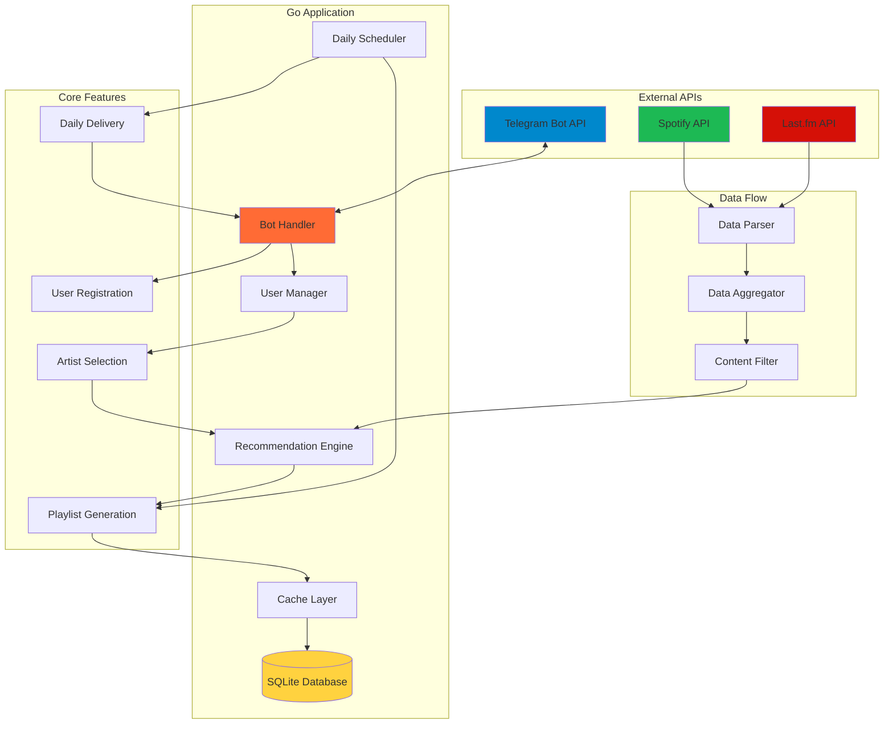

# 🎵 Go Language Learning Plan: Telegram Music Bot

**A Complete Study Guide for Senior JavaScript Developers**

---

## 📊 Overview

This comprehensive study plan will guide you through learning Go (Golang) by building a real-world Telegram bot that parses and aggregates music data to create personalized daily playlists. The plan is designed for experienced JavaScript developers transitioning to Go.

**Estimated Timeline:** 8-12 weeks  
**Final Project:** A production-ready Telegram bot with music recommendation engine

---

## 🎯 Learning Objectives

By completing this plan, you will:

- Master Go fundamentals and idioms
- Build a complete Telegram bot application
- Integrate multiple music APIs (Spotify, Last.fm)
- Implement data parsing and aggregation systems
- Deploy and monitor a production Go application
- Understand Go's concurrency model and best practices

---

## 🏗️ Architecture Overview



---

## 📚 Learning Path

```mermaid
graph TD
    A["🎯 Start: Go Fundamentals"] --> B["🔧 Development Setup"]
    B --> C["📚 Go Core Concepts"]
    C --> D["🌐 HTTP & JSON"]
    D --> E["📦 Go Modules"]

    E --> F["🤖 Telegram Bot Basics"]
    F --> G["💬 Simple Bot Commands"]
    G --> H["⌨️ Keyboards & UI"]

    H --> I["🎵 Music APIs Setup"]
    I --> J["🎧 Spotify Integration"]
    J --> K["📻 Last.fm Integration"]

    K --> L["🗄️ Database Design"]
    L --> M["💾 Database Implementation"]
    M --> N["👤 User Management"]

    N --> O["⭐ Artist Selection"]
    O --> P["🤖 Recommendation Engine"]
    P --> Q["📋 Playlist Generation"]
    Q --> R["⏰ Daily Scheduler"]

    R --> S["🔧 Data Parser"]
    S --> T["⚠️ Error Handling"]
    T --> U["🚦 Rate Limiting"]
    U --> V["🎨 Enhanced UI"]

    V --> W["⚙️ Configuration"]
    W --> X["📊 Logging & Monitoring"]
    X --> Y["🧪 Testing"]
    Y --> Z["🚀 Deployment"]

    Z --> AA["📈 Production Monitoring"]
    AA --> BB["⚡ Performance Optimization"]
    BB --> CC["🔥 Advanced Features"]
    CC --> DD["📖 Documentation"]

    style A fill:#e1f5fe
    style F fill:#f3e5f5
    style I fill:#e8f5e8
    style L fill:#fff3e0
    style O fill:#fce4ec
    style Z fill:#e0f2f1
```



---

## ✅ Detailed Study Plan

### Phase 1: Go Fundamentals (Weeks 1-2)

#### 1. **Development Environment Setup**

**Goal:** Get Go development environment ready

- Install Go from [golang.org](https://golang.org/download/)
- Configure GOPATH/GOMOD workspace
- Set up VS Code with Go extension
- Install essential Go tools: `go install golang.org/x/tools/...@latest`

**Resources:**

- [Official Go Installation Guide](https://golang.org/doc/install)
- [VS Code Go Extension](https://marketplace.visualstudio.com/items?itemName=golang.Go)

#### 2. **Go Language Fundamentals**

**Goal:** Master basic Go syntax and concepts

- Variables, constants, and data types
- Functions and methods
- Structs and interfaces
- Pointers (key difference from JS)
- Control structures (if, for, switch)
- Error handling patterns

**Key Differences for JS Developers:**

```go
// Explicit typing
var name string = "John"
age := 25 // Type inference

// Multiple return values
func divide(a, b int) (int, error) {
    if b == 0 {
        return 0, errors.New("division by zero")
    }
    return a / b, nil
}

// Pointers
var x int = 10
var p *int = &x
fmt.Println(*p) // Dereference pointer
```

**Resources:**

- [A Tour of Go](https://tour.golang.org/)
- [Go by Example](https://gobyexample.com/)

#### 3. **HTTP Client and JSON Handling**

**Goal:** Master Go's HTTP and JSON capabilities

- `net/http` package for HTTP requests
- `encoding/json` for JSON marshaling/unmarshaling
- HTTP client best practices
- Context for request cancellation

**Example:**

```go
type APIResponse struct {
    Data   string `json:"data"`
    Status int    `json:"status"`
}

func makeRequest(url string) (*APIResponse, error) {
    resp, err := http.Get(url)
    if err != nil {
        return nil, err
    }
    defer resp.Body.Close()

    var result APIResponse
    if err := json.NewDecoder(resp.Body).Decode(&result); err != nil {
        return nil, err
    }

    return &result, nil
}
```

#### 4. **Go Modules and Dependencies**

**Goal:** Understand Go's dependency management

- `go mod init` for new projects
- `go mod tidy` for cleanup
- Importing and using external packages
- Version management

### Phase 2: Telegram Bot Development (Weeks 3-4)

#### 5. **Telegram Bot Setup**

**Goal:** Create and configure your first Telegram bot

- Chat with [@BotFather](https://t.me/botfather)
- Create bot with `/newbot` command
- Get bot token
- Test with simple HTTP requests

**BotFather Commands:**

```
/newbot
Your Bot Name
your_bot_username_bot
```

#### 6. **Simple Telegram Bot Implementation**

**Goal:** Build basic bot functionality

- Use `github.com/go-telegram-bot-api/telegram-bot-api/v5`
- Handle `/start` command
- Echo user messages
- Basic error handling

**Example Bot:**

```go
package main

import (
    "log"
    "os"

    tgbotapi "github.com/go-telegram-bot-api/telegram-bot-api/v5"
)

func main() {
    bot, err := tgbotapi.NewBotAPI(os.Getenv("TELEGRAM_TOKEN"))
    if err != nil {
        log.Panic(err)
    }

    bot.Debug = true
    log.Printf("Authorized on account %s", bot.Self.UserName)

    u := tgbotapi.NewUpdate(0)
    u.Timeout = 60

    updates := bot.GetUpdatesChan(u)

    for update := range updates {
        if update.Message == nil {
            continue
        }

        msg := tgbotapi.NewMessage(update.Message.Chat.ID,
            "Hello, "+update.Message.From.FirstName+"!")
        bot.Send(msg)
    }
}
```

#### 7. **Advanced Bot Features**

**Goal:** Implement keyboards and command handling

- Inline keyboards for user interaction
- Custom keyboards
- Command routing
- Message handling patterns

**Inline Keyboard Example:**

```go
keyboard := tgbotapi.NewInlineKeyboardMarkup(
    tgbotapi.NewInlineKeyboardRow(
        tgbotapi.NewInlineKeyboardButtonData("Add Artist", "add_artist"),
        tgbotapi.NewInlineKeyboardButtonData("My Playlist", "my_playlist"),
    ),
)

msg := tgbotapi.NewMessage(chatID, "Choose an option:")
msg.ReplyMarkup = keyboard
```

### Phase 3: Music APIs Integration (Weeks 5-6)

#### 8. **Music APIs Research and Setup**

**Goal:** Understand and register for music APIs

- Spotify Developer Account setup
- Last.fm API registration
- API rate limits and best practices
- Authentication flows (OAuth2 for Spotify)

**API Registrations:**

- [Spotify Developer Dashboard](https://developer.spotify.com/dashboard/)
- [Last.fm API Account](https://www.last.fm/api/account/create)

#### 9. **Spotify API Integration**

**Goal:** Implement Spotify functionality

- Use `github.com/zmb3/spotify/v2` library
- Artist search functionality
- Get similar artists
- Track recommendations
- OAuth2 authentication

**Spotify Client Example:**

```go
import "github.com/zmb3/spotify/v2"

// Client credentials flow
config := &clientcredentials.Config{
    ClientID:     os.Getenv("SPOTIFY_ID"),
    ClientSecret: os.Getenv("SPOTIFY_SECRET"),
    TokenURL:     spotifyauth.TokenURL,
}

token, err := config.Token(ctx)
if err != nil {
    log.Fatal(err)
}

client := spotify.New(auth.Client(ctx, token))

// Search for artists
results, err := client.Search(ctx, "artist:Radiohead", spotify.SearchTypeArtist)
```

#### 10. **Last.fm API Integration**

**Goal:** Add Last.fm for additional music data

- HTTP client for Last.fm API
- Artist information retrieval
- Similar artists data
- Track metadata

**Last.fm Request Example:**

```go
func getLastFMSimilarArtists(artist string) ([]Artist, error) {
    apiKey := os.Getenv("LASTFM_API_KEY")
    url := fmt.Sprintf("http://ws.audioscrobbler.com/2.0/?method=artist.getsimilar&artist=%s&api_key=%s&format=json",
        url.QueryEscape(artist), apiKey)

    resp, err := http.Get(url)
    if err != nil {
        return nil, err
    }
    defer resp.Body.Close()

    var result LastFMResponse
    if err := json.NewDecoder(resp.Body).Decode(&result); err != nil {
        return nil, err
    }

    return result.SimilarArtists.Artists, nil
}
```

### Phase 4: Data Management (Weeks 7-8)

#### 11. **Database Design**

**Goal:** Design data schema for the application

- Users table (Telegram user info)
- Artists table (favorite artists per user)
- Playlists table (generated playlists)
- Tracks cache table
- Choose SQLite for simplicity

**Schema Example:**

```sql
CREATE TABLE users (
    id INTEGER PRIMARY KEY AUTOINCREMENT,
    telegram_id INTEGER UNIQUE NOT NULL,
    username TEXT,
    first_name TEXT,
    created_at DATETIME DEFAULT CURRENT_TIMESTAMP
);

CREATE TABLE user_artists (
    id INTEGER PRIMARY KEY AUTOINCREMENT,
    user_id INTEGER,
    artist_name TEXT,
    spotify_id TEXT,
    added_at DATETIME DEFAULT CURRENT_TIMESTAMP,
    FOREIGN KEY (user_id) REFERENCES users (id)
);

CREATE TABLE playlists (
    id INTEGER PRIMARY KEY AUTOINCREMENT,
    user_id INTEGER,
    playlist_data TEXT, -- JSON of tracks
    created_at DATETIME DEFAULT CURRENT_TIMESTAMP,
    FOREIGN KEY (user_id) REFERENCES users (id)
);
```

#### 12. **Database Implementation**

**Goal:** Implement database operations

- Use `database/sql` with SQLite driver
- CRUD operations for all tables
- Connection pooling
- Transaction handling

**Database Layer Example:**

```go
type Database struct {
    db *sql.DB
}

func NewDatabase(dbPath string) (*Database, error) {
    db, err := sql.Open("sqlite3", dbPath)
    if err != nil {
        return nil, err
    }

    return &Database{db: db}, nil
}

func (d *Database) CreateUser(telegramID int64, username, firstName string) error {
    query := `INSERT INTO users (telegram_id, username, first_name) VALUES (?, ?, ?)`
    _, err := d.db.Exec(query, telegramID, username, firstName)
    return err
}

func (d *Database) AddUserArtist(userID int, artistName, spotifyID string) error {
    query := `INSERT INTO user_artists (user_id, artist_name, spotify_id) VALUES (?, ?, ?)`
    _, err := d.db.Exec(query, userID, artistName, spotifyID)
    return err
}
```

#### 13. **User Management System**

**Goal:** Handle user registration and preferences

- New user onboarding flow
- Store user preferences
- User state management
- Privacy considerations

### Phase 5: Core Bot Logic (Weeks 9-10)

#### 14. **Artist Selection Interface**

**Goal:** Let users manage their favorite artists

- Search and add artists
- Display current favorites
- Remove artists
- Artist validation

#### 15. **Recommendation Engine**

**Goal:** Build the core recommendation logic

- Algorithm to find similar artists
- Combine multiple data sources
- Avoid duplicate recommendations
- Weight user preferences

**Recommendation Algorithm:**

```go
type RecommendationEngine struct {
    spotify *spotify.Client
    lastfm  *LastFMClient
    db      *Database
}

func (r *RecommendationEngine) GenerateRecommendations(userID int) ([]Track, error) {
    // Get user's favorite artists
    artists, err := r.db.GetUserArtists(userID)
    if err != nil {
        return nil, err
    }

    var allTracks []Track

    // For each artist, get similar artists and their top tracks
    for _, artist := range artists {
        similar, err := r.getSimilarArtists(artist.SpotifyID)
        if err != nil {
            continue
        }

        for _, simArtist := range similar {
            tracks, err := r.getTopTracks(simArtist.ID)
            if err != nil {
                continue
            }
            allTracks = append(allTracks, tracks...)
        }
    }

    // Remove duplicates and limit results
    return r.deduplicateAndLimit(allTracks, 20), nil
}
```

#### 16. **Playlist Generation**

**Goal:** Create personalized playlists

- Combine user favorites with discoveries
- Format for different outputs
- Cache generated playlists
- Handle empty results

#### 17. **Daily Scheduler**

**Goal:** Automate daily playlist delivery

- Use `github.com/robfig/cron/v3` for scheduling
- Handle timezone considerations
- Batch processing for multiple users
- Error recovery

**Cron Scheduler Example:**

```go
import "github.com/robfig/cron/v3"

func (b *Bot) StartScheduler() {
    c := cron.New()

    // Send daily playlists at 9 AM
    c.AddFunc("0 9 * * *", func() {
        users, err := b.db.GetAllActiveUsers()
        if err != nil {
            log.Printf("Error getting users: %v", err)
            return
        }

        for _, user := range users {
            playlist, err := b.engine.GenerateRecommendations(user.ID)
            if err != nil {
                log.Printf("Error generating playlist for user %d: %v", user.ID, err)
                continue
            }

            b.sendPlaylist(user.TelegramID, playlist)
        }
    })

    c.Start()
}
```

### Phase 6: Data Processing (Week 11)

#### 18. **Data Parser Implementation**

**Goal:** Robust data parsing from multiple sources

- Parse artist data from APIs
- Handle different data formats
- Validate and clean data
- Error handling for malformed data

#### 19. **Error Handling and Resilience**

**Goal:** Make the application production-ready

- Comprehensive error handling
- API failure recovery
- Database error handling
- User input validation
- Graceful degradation

#### 20. **Rate Limiting and Caching**

**Goal:** Respect API limits and improve performance

- Implement rate limiting for APIs
- Cache frequently requested data
- Implement backoff strategies
- Monitor API usage

**Rate Limiter Example:**

```go
import "golang.org/x/time/rate"

type RateLimitedClient struct {
    client  *http.Client
    limiter *rate.Limiter
}

func NewRateLimitedClient(requestsPerSecond int) *RateLimitedClient {
    return &RateLimitedClient{
        client:  &http.Client{},
        limiter: rate.NewLimiter(rate.Limit(requestsPerSecond), 1),
    }
}

func (r *RateLimitedClient) Get(url string) (*http.Response, error) {
    err := r.limiter.Wait(context.Background())
    if err != nil {
        return nil, err
    }

    return r.client.Get(url)
}
```

### Phase 7: Production Readiness (Week 12)

#### 21. **Enhanced User Interface**

**Goal:** Improve bot user experience

- Help commands and documentation
- Settings and preferences menu
- Playlist history viewing
- User usage statistics

#### 22. **Configuration Management**

**Goal:** Proper configuration handling

- Environment variables
- Configuration files
- API keys management
- Multiple environment support

#### 23. **Logging and Monitoring**

**Goal:** Production observability

- Structured logging with levels
- Error tracking and alerting
- Performance monitoring
- User analytics

**Logging Example:**

```go
import "github.com/sirupsen/logrus"

var logger = logrus.New()

func init() {
    logger.SetFormatter(&logrus.JSONFormatter{})
    logger.SetLevel(logrus.InfoLevel)
}

func (b *Bot) HandleMessage(update tgbotapi.Update) {
    logger.WithFields(logrus.Fields{
        "user_id": update.Message.From.ID,
        "message": update.Message.Text,
    }).Info("Received message")

    // Handle message...
}
```

#### 24. **Testing Implementation**

**Goal:** Ensure code quality and reliability

- Unit tests for core functions
- Integration tests for APIs
- Mock external dependencies
- Test coverage analysis

#### 25. **Deployment Preparation**

**Goal:** Prepare for production deployment

- Dockerize the application
- Create deployment scripts
- Environment configuration
- Security considerations

**Dockerfile Example:**

```dockerfile
FROM golang:1.19-alpine AS builder

WORKDIR /app
COPY go.mod go.sum ./
RUN go mod download

COPY . .
RUN go build -o main .

FROM alpine:latest
RUN apk --no-cache add ca-certificates
WORKDIR /root/

COPY --from=builder /app/main .

CMD ["./main"]
```

#### 26. **Production Deployment**

**Goal:** Deploy to production environment

- Choose hosting platform (VPS, Heroku, AWS)
- Set up CI/CD pipeline
- Configure webhooks vs polling
- SSL/TLS configuration

#### 27. **Production Monitoring**

**Goal:** Monitor live application

- Health checks and uptime monitoring
- Error alerting systems
- Performance metrics
- User usage analytics

### Phase 8: Optimization and Advanced Features

#### 28. **Performance Optimization**

**Goal:** Optimize for production scale

- Database indexing and query optimization
- Connection pooling
- Memory usage optimization
- Concurrent processing with goroutines

#### 29. **Advanced Features**

**Goal:** Enhance bot capabilities

- Genre-based preferences
- Mood-based playlist generation
- Collaborative filtering
- User feedback integration
- Export playlists to Spotify

#### 30. **Documentation and Maintenance**

**Goal:** Complete the project professionally

- Code documentation and comments
- API documentation
- User guide and help system
- Deployment and maintenance guide

---

## 🔧 Essential Tools and Libraries

### Core Go Libraries

- **Standard Library**: `net/http`, `encoding/json`, `database/sql`, `context`
- **Telegram Bot**: `github.com/go-telegram-bot-api/telegram-bot-api/v5`
- **Spotify API**: `github.com/zmb3/spotify/v2`
- **Database**: `github.com/mattn/go-sqlite3`
- **Scheduling**: `github.com/robfig/cron/v3`
- **Rate Limiting**: `golang.org/x/time/rate`
- **Logging**: `github.com/sirupsen/logrus`
- **Testing**: Built-in `testing` package

### Development Tools

- **IDE**: VS Code with Go extension
- **Linting**: `golangci-lint`
- **Formatting**: `gofmt`, `goimports`
- **Documentation**: `godoc`
- **Debugging**: Delve debugger

---

## 📚 Learning Resources

### Official Documentation

- [Go Documentation](https://golang.org/doc/)
- [Effective Go](https://golang.org/doc/effective_go.html)
- [Go Code Review Comments](https://github.com/golang/go/wiki/CodeReviewComments)

### Interactive Learning

- [A Tour of Go](https://tour.golang.org/)
- [Go by Example](https://gobyexample.com/)
- [Go Playground](https://play.golang.org/)

### Books

- "The Go Programming Language" by Donovan & Kernighan
- "Learning Go" by Jon Bodner
- "Go in Action" by William Kennedy

### API Documentation

- [Telegram Bot API](https://core.telegram.org/bots/api)
- [Spotify Web API](https://developer.spotify.com/documentation/web-api/)
- [Last.fm API](https://www.last.fm/api)

### Community

- [Go Subreddit](https://reddit.com/r/golang)
- [Gophers Slack](https://gophers.slack.com/)
- [Go Forum](https://forum.golangbridge.org/)

---

## 🎯 Key Differences for JavaScript Developers

### Type System

```javascript
// JavaScript
let data = await fetch("/api/data").then((r) => r.json());
```

```go
// Go
type APIResponse struct {
    Data   string `json:"data"`
    Status int    `json:"status"`
}

resp, err := http.Get("/api/data")
if err != nil {
    return err
}
defer resp.Body.Close()

var data APIResponse
err = json.NewDecoder(resp.Body).Decode(&data)
```

### Error Handling

```javascript
// JavaScript
try {
  const result = await riskyOperation();
  console.log(result);
} catch (error) {
  console.error(error);
}
```

```go
// Go
result, err := riskyOperation()
if err != nil {
    log.Printf("Error: %v", err)
    return err
}
fmt.Println(result)
```

### Concurrency

```javascript
// JavaScript
async function processUsers(users) {
  const promises = users.map((user) => processUser(user));
  return Promise.all(promises);
}
```

```go
// Go
func processUsers(users []User) error {
    var wg sync.WaitGroup
    errorCh := make(chan error, len(users))

    for _, user := range users {
        wg.Add(1)
        go func(u User) {
            defer wg.Done()
            if err := processUser(u); err != nil {
                errorCh <- err
            }
        }(user)
    }

    wg.Wait()
    close(errorCh)

    for err := range errorCh {
        if err != nil {
            return err
        }
    }
    return nil
}
```

---

## 🚀 Success Metrics

Track your progress with these milestones:

- [ ] **Week 1**: Successfully run "Hello World" in Go
- [ ] **Week 2**: Create a simple HTTP server
- [ ] **Week 3**: Bot responds to /start command
- [ ] **Week 4**: Bot handles inline keyboards
- [ ] **Week 5**: Successfully query Spotify API
- [ ] **Week 6**: Integrate Last.fm data
- [ ] **Week 7**: Save user data to database
- [ ] **Week 8**: Generate first recommendation
- [ ] **Week 9**: Send automated daily playlist
- [ ] **Week 10**: Handle 100+ concurrent users
- [ ] **Week 11**: Deploy to production
- [ ] **Week 12**: Add advanced features

---

## 📞 Next Steps

1. **Set up your environment** following Phase 1
2. **Mark TODO #1 as in-progress** when you start
3. **Join Go communities** for support
4. **Start coding!** The best way to learn is by doing

Remember: As a Senior JavaScript developer, you already understand programming concepts. Focus on Go's unique features like static typing, explicit error handling, and goroutines. The syntax will become natural with practice!

Good luck with your Go learning journey! 🎵🐹

---

_Last updated: January 2025_
